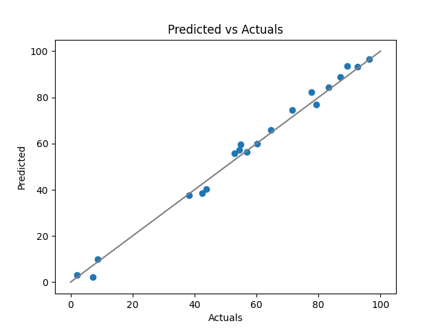

# Insights and other explainability tools

[EN](insights.md) | [UA](insights_ua.md) | [RU](insights_ru.md)

## "Predicted vs Actuals" family

### Basic "Predicted vs Actuals"



{::options parse_block_html="true" /}

<details>
<summary>Python code for the plot</summary>

```python
import matplotlib.pyplot as plt
import numpy as np
# Fixed random generator
rng = np.random.RandomState(0)
# Generate actuals and predicted close to them
row_count = 20
actuals = rng.uniform(0, 100, row_count)
predicted = actuals + rng.uniform(-5, 5, row_count)
# Show them alongside the perfect match line
plt.scatter(actuals, predicted)
plt.plot([0, 100], [0, 100], c="gray")
plt.title("Predicted vs Actuals")
plt.xlabel("Actuals")
plt.ylabel("Predicted")
plt.show()
```

</details>

{::options parse_block_html="false" /}

PROS: 

CONS:

